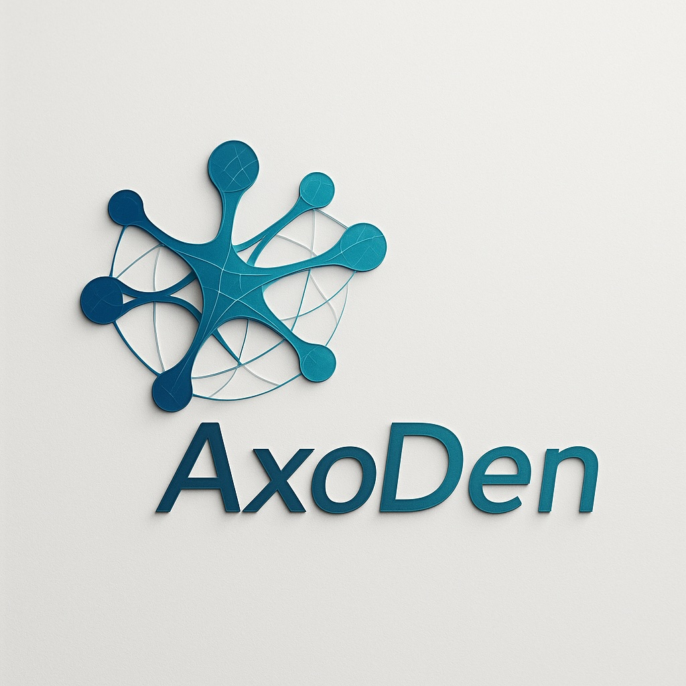

  

  
  
  

---

# 🌀 Entropic
### Formal Frameworks for Entropy-Bounded, Certifiable AI Systems  
**Author:** Erkan Yalcinkaya — *AxoDen Labs / Luminesce Limited*  
**DOI:** [10.5281/zenodo.17591298](https://doi.org/10.5281/zenodo.17591298)  
**License:** Creative Commons Attribution-NonCommercial-ShareAlike 4.0 International (CC BY-NC-SA 4.0)

---

## 📖 Overview
**Entropic** unifies the *Entropy-Bounded Data Pipelines (EBDP)* and *Entropy-Frugal Intelligence (EFI)* frameworks, providing a rigorous, information-theoretic foundation for **trustworthy, safety-critical AI**.  

It introduces:
- **Entropy budgets** for each pipeline stage (`EBDP`)
- **Entropy-frugality constraints** on model states (`EFI`)
- **Variational State Reconciliation (VSR)** for repairing budget violations
- **EFI Surplus** metrics for runtime fabrication detection
- **Stochastic certification protocols** for safety audits
- **Entropy-aware runtime control** and autoscaling strategies
- **Pareto-optimized design trade-offs** between entropy, latency, and cost  

Together, these components transform reactive monitoring into **proactive, compositional assurance** — suitable for ISO 26262, DO-178C, IEC 62304, and AI governance frameworks.

---
## **🔬 Core Concepts**

| **Concept**               | **Description**                                                                                                 |
| ------------------------- | --------------------------------------------------------------------------------------------------------------- |
| **EBDP**                  | Assigns explicit entropy budgets (H_k^{max}) to each stage, ensuring uncertainty grows within certified limits. |
| **EFI**                   | Constrains exogenous information injection via (I(X_k; M_k \mid X_{k-1}) \le \varepsilon_k).                    |
| **VSR**                   | Repairs violated budgets using convex optimization and KL-regularized reconciliation.                           |
| **EFI Surplus**           | Detects fabrication by measuring unexplained influence of model states.                                         |
| **Entropy-Aware Control** | Treats data quality as a control signal for autoscaling and backpressure.                                       |

---

## **📜 Citation**

  

If you use this framework or reference implementation, please cite:

  

> Yalcinkaya, E. (2025). _Entropy-Bounded Data Pipelines and Entropy-Frugal Intelligence: A Compositional Framework for Quantitative Assurance in Industrial AI Systems (v3.0)._ Zenodo. [https://doi.org/10.5281/zenodo.17591298](https://doi.org/10.5281/zenodo.17591298)

@misc{yalcinkaya2025entropic,
  author       = {Erkan Yalcinkaya},
  title        = {Entropy-Bounded Data Pipelines and Entropy-Frugal Intelligence:
                  A Compositional Framework for Quantitative Assurance in Industrial AI Systems},
  year         = {2025},
  publisher    = {Zenodo},
  version      = {1.1},
  doi          = {10.5281/zenodo.17591298},
  url          = {https://doi.org/10.5281/zenodo.17591298}
}

## **📚 License**

  

© 2025 Erkan Yalcinkaya / Luminesce Limited.

Released under the **Creative Commons Attribution-NonCommercial-ShareAlike 4.0 International** license.

Commercial use and enterprise deployment require a separate license — contact **yalcinkaya@axodenlabs.org**.

---

## **🌐 Links**

- 🔗 [Zenodo DOI](https://doi.org/10.5281/zenodo.17591298)
    
- 🧠 [AxoDen Labs](https://axoden.org)
    
- 💬 Contact: **yalcinkaya@axodenlabs.org**
    

---

